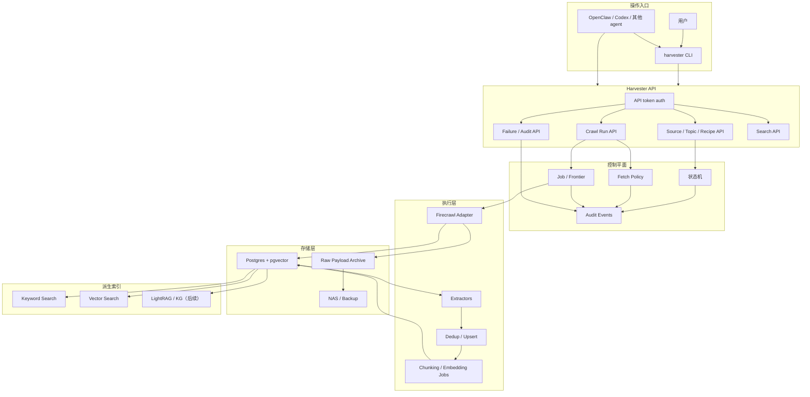
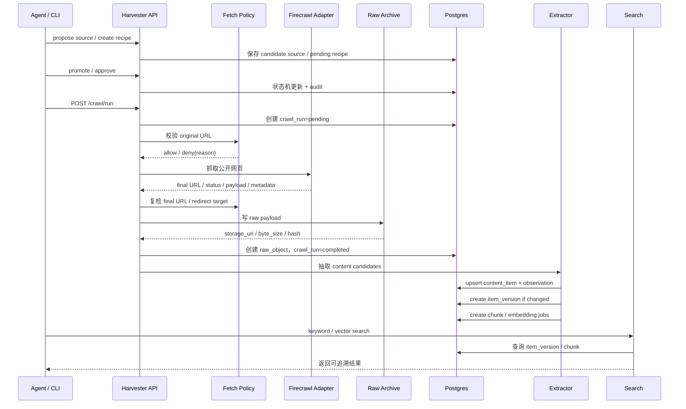
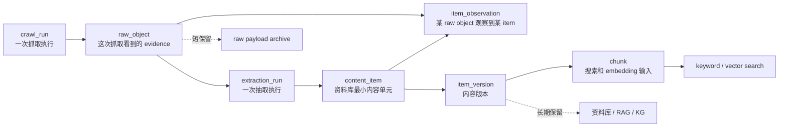

# Harvester

Harvester 是个人 home lab 信息采集控制平面。第一版目标是打通公开网页抓取、raw evidence 保存、content item 抽取、去重、chunk/index、搜索、审计和可部署基座。

核心边界：

```text
raw_object 只回答：这次抓取看到了什么。
content_item / item_version / chunk 才是资料库和搜索层。
```

## 当前状态

已完成：

- Python 项目骨架、FastAPI API、Typer CLI、SQLAlchemy/Alembic。
- Source、Topic、Recipe、CrawlRun、RawObject、ContentItem、ItemVersion、Chunk、Job、AuditEvent 等核心 schema。
- API token、source/topic/recipe 状态机、失败查询。
- Postgres job/frontier、抽取 pipeline、去重、raw payload retention metadata。
- CDC/Sina fixture extractor、deterministic fixture soak。
- keyword search、pgvector-ready chunk/vector search、Docker Compose smoke 基座。
- 真实公开网页抓取：Firecrawl adapter、fetch policy（DNS/IP 分类、redirect 复检）、raw payload archive、crawl API/CLI、CDC smoke。
- Watch scheduler：watch_schedules 表、schedule API/CLI、one-shot scheduler、crawl job handler、crawl worker、队列状态查看。

后续：

- LightRAG batch index、轻量 KG、可选 MCP adapter。
- 登录态、高风险 recipe、browser profile、sandbox。

## 架构图



## 抓取到搜索流程



## 数据分层



## 安全边界

真实抓取必须默认防守：

- 只允许公开 `http` / `https` URL。
- DNS 解析后拒绝 localhost、private IP、link-local、multicast、reserved、unspecified。
- redirect 后必须重新校验 final URL。
- 设置 timeout、最大响应大小、最大 redirect 次数。
- 拒绝原因写入 `audit_events` 和 `crawl_runs.error_message`。
- CLI 的状态变更必须通过 HTTP API，不直接写数据库。

## 本地开发

安装依赖：

```bash
uv sync --all-extras
```

运行测试：

```bash
uv run pytest -q
```

启动 API：

```bash
uv run uvicorn harvester.api.app:create_app --factory --reload
```

检查 API：

```bash
uv run harvester --base-url http://localhost:8001
```

Docker Compose smoke：

```bash
docker compose config
./scripts/smoke.sh
```

执行公开网页抓取：

```bash
# 配置 Firecrawl（在 .env 中设置）
FIRECRAWL_API_URL=http://localhost:3002

# 通过 CLI 触发抓取
uv run harvester crawl run --source-id <source-id> --recipe-id <recipe-id>

# 通过 API 触发抓取
curl -X POST http://localhost:8001/crawl/run \
  -H "Authorization: Bearer $HARVESTER_API_TOKEN" \
  -H "Content-Type: application/json" \
  -d '{"source_id": "...", "recipe_id": "..."}'

# 启用 live smoke（真实网络测试）
HARVESTER_ENABLE_LIVE_CRAWL=1 uv run pytest tests/integration/test_cdc_public_crawl_smoke.py -q
```

## Watch Scheduler 与 Crawl Worker

Harvester 支持为 Source 或 Topic Watch 创建定时调度（watch schedule），由 scheduler 按间隔自动创建 crawl job，crawl worker 消费 job 执行抓取。

### 创建 Schedule

```bash
# 为 source 创建定时调度（每 3600 秒抓取一次）
uv run harvester schedule create \
  --source-id <source-id> \
  --recipe-id <recipe-id> \
  --interval 3600

# 为 topic watch 的 source 创建调度
uv run harvester schedule create \
  --source-id <source-id> \
  --topic-watch-id <topic-id> \
  --recipe-id <recipe-id> \
  --interval 1800
```

### Scheduler 运行模式

#### One-shot（手动触发）

Scheduler 的 one-shot 命令每次调用扫描到期 schedule 并创建 crawl job。可配合 cron/systemd 定期执行。

```bash
# 执行一次 scheduler
uv run harvester scheduler run
# 输出: scanned=N enqueued=N skipped=N duplicates=N
```

#### Scheduler Daemon（长期运行）

Scheduler daemon 按配置的轮询间隔持续扫描到期 schedule，自动创建 crawl job。**注意：scheduler 只创建 `crawl` job，不直接执行网络抓取。**

```bash
# 启动 scheduler daemon（默认每 30 秒轮询一次）
uv run harvester scheduler daemon
# 自定义轮询间隔和每轮处理数量
uv run harvester scheduler daemon --poll-interval 10 --limit 50
```

### Crawl Worker 运行模式

#### One-shot（手动触发）

```bash
# 处理 pending 的 crawl job
uv run harvester worker once --job-type crawl --limit 10
```

#### Crawl Worker Daemon（长期运行）

Crawl worker daemon 持续消费 `crawl` job。**不会初始化 embedding adapter，不会认领 `embed_chunks` 或 `extract` job。**

```bash
# 启动 crawl worker daemon
uv run harvester worker run --job-type crawl --poll-interval 5 --limit 10
```

默认 `worker run`（不带 `--job-type`）仍只启动 embedding worker，不会改变已有行为。

### 本地开发启动

`./start.sh` 默认只启动后端 API（端口 `8001`）和前端 dev server（端口 `5173`）。

```bash
# 默认启动（不含 daemon）
./start.sh

# 启动后端 + 前端 + scheduler daemon + crawl worker daemon
HARVESTER_START_DAEMONS=1 ./start.sh
```

### Docker Compose 部署

`docker-compose.yml` 默认启动所有服务：
- `server`：Harvester API（端口 `8001`）
- `worker`：Embedding worker daemon
- `scheduler`：Scheduler daemon
- `crawl-worker`：Crawl worker daemon

每个服务有独立的 command、healthcheck 和环境变量配置，便于单独重启和观察。

```bash
docker compose up -d
```

### 查看队列状态

```bash
# 通过 CLI
uv run harvester queue status

# 通过 API
curl -H "Authorization: Bearer $HARVESTER_API_TOKEN" \
  http://localhost:8001/queue/status
```

### 架构约束

- **Scheduler 只创建 `crawl` job**，不直接调用网络抓取 adapter。
- **Embedding 只能从 `item_version -> chunk` 开始**，不能对 raw HTML/API payload 做 embedding。
- 默认 embedding worker 不会认领 `crawl` 或 `extract` job，各 job type 完全隔离。

### 审计日志保留

审计事件（`audit_events`）是控制平面的近期解释层，**不是** raw evidence、content item 或 job 历史的长期存储。

- **默认保留 7 天**，可通过 `HARVESTER_AUDIT_RETENTION_DAYS` 环境变量覆盖。
- Scheduler daemon 自动按 24 小时间隔执行清理（可通过 `HARVESTER_AUDIT_CLEANUP_INTERVAL_HOURS` 调整）。
- 清理**只删除过期 audit events**，不会删除 source、recipe、schedule、crawl run、job、raw object、content item、item version 或 chunk。
- 归档、废弃和停用等管理动作产生的 audit events 同样遵循保留策略，但业务记录和历史引用不受影响。

## Embedding 适配器

Harvester 的 embedding 只对 `item_version -> chunk` 做 embedding，**不对 raw HTML/API payload 做 embedding**。`raw_object` 是短保留 evidence cache，不是长期语料库。默认 raw HTML/API payload 可按约 7 天保留；提取成功后可压缩或删除 payload。长期保留的是 metadata、hash、audit、`content_item`、`item_observation`、`item_version`、`chunk`。Worker 和 vector search API 共用同一个适配器工厂，确保 chunk embedding 和 query embedding 使用一致的模型和维度。

### 默认：Stub 适配器

默认使用 deterministic stub 适配器，不需要外部模型服务，适合离线开发和 CI。

```bash
# 默认行为，无需额外配置
uv run harvester worker once --limit 10
```

### 切换到 Qwen 适配器

在 `.env` 中设置以下环境变量即可切换到本地 Qwen embedding 服务（OpenAI-compatible API）：

```bash
HARVESTER_EMBEDDING_ADAPTER=qwen
HARVESTER_EMBEDDING_MODEL=text-embedding-v3
HARVESTER_EMBEDDING_DIMENSION=1536
HARVESTER_QWEN_EMBEDDING_BASE_URL=http://localhost:8080
HARVESTER_QWEN_EMBEDDING_TIMEOUT_SECONDS=30
```

切换后 worker 和 vector search API 都会使用 Qwen 适配器。回滚时删除或注释 `HARVESTER_EMBEDDING_ADAPTER=qwen` 即可回到 stub。

### Live Smoke 测试

当本地 Qwen 服务可用时，可以运行 live smoke 测试：

```bash
HARVESTER_EMBEDDING_ADAPTER=qwen \
HARVESTER_EMBEDDING_MODEL=text-embedding-v3 \
HARVESTER_QWEN_EMBEDDING_BASE_URL=http://localhost:8080 \
HARVESTER_LIVE_QWEN_EMBEDDING=1 \
uv run pytest tests/integration/test_vector_search_api_pipeline.py -q
```

## 前端管理控制台

Harvester 提供基于 React + TypeScript + Vite 的管理控制台，用于可视化操作和监控。

### 启动前端开发服务器

```bash
cd frontend
npm install
npm run dev
```

前端默认运行在 `http://localhost:5173`，会代理 `/api` 请求到后端 `http://localhost:8001`。

### 配置 API 连接

在控制台的 Overview 页面配置：
- **API Base URL**: 后端地址，如 `http://localhost:8001`
- **API Token**: 可选的 Bearer token（对应环境变量 `HARVESTER_API_TOKEN`）

配置保存在浏览器 localStorage 中。

### 前端开发命令

```bash
cd frontend
npm run format          # Prettier 格式化
npm run lint            # ESLint 检查
npm run typecheck       # TypeScript 类型检查
npm run test            # 运行单元测试（Vitest）
npm run test:e2e        # 运行 E2E 测试（Playwright，需先启动 API 和 dev server）
npm run build           # 构建生产版本
```

### 启动后端 API

前端需要后端 API 运行：

```bash
uv run uvicorn harvester.api.app:create_app --factory --host 0.0.0.0 --port 8001
```

## 设计文档

- [Harvester 个人信息采集控制平面](docs/designs/office-hours-harvester-20260508-201322.md)
- [设计文档索引](docs/designs/README.md)
