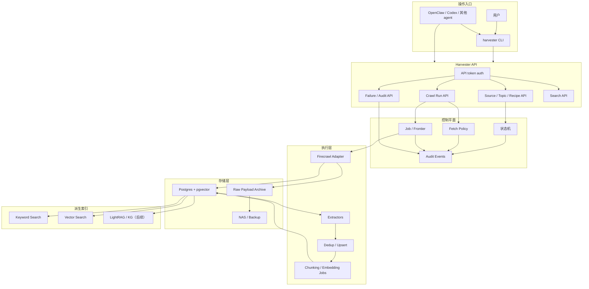
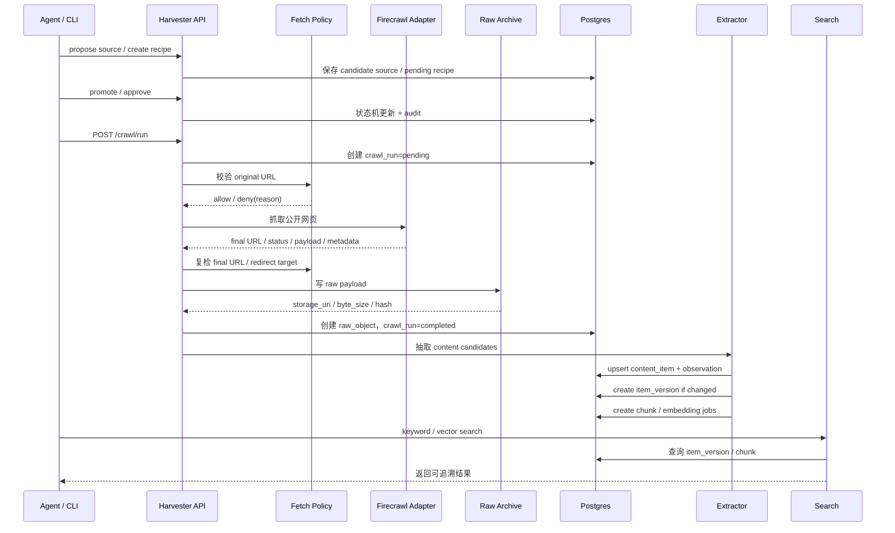
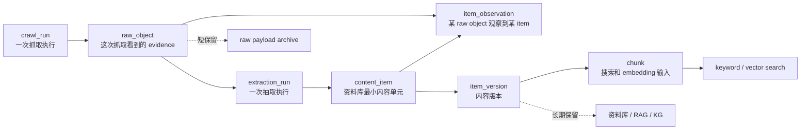

# Harvester

Harvester 是个人 home lab 信息采集控制平面。第一版目标是打通公开网页抓取、raw evidence 保存、content item 抽取、去重、chunk/index、搜索、审计和可部署基座。

核心边界：

```text
raw_object 只回答：这次抓取看到了什么。
content_item / item_version / chunk 才是资料库和搜索层。
```

## 当前状态

已完成：

- Python 项目骨架、FastAPI API、Typer CLI、SQLAlchemy/Alembic。
- Source、Topic、Recipe、CrawlRun、RawObject、ContentItem、ItemVersion、Chunk、Job、AuditEvent 等核心 schema。
- API token、source/topic/recipe 状态机、失败查询。
- Postgres job/frontier、抽取 pipeline、去重、raw payload retention metadata。
- CDC/Sina fixture extractor、deterministic fixture soak。
- keyword search、pgvector-ready chunk/vector search、Docker Compose smoke 基座。
- 真实公开网页抓取：Firecrawl adapter、fetch policy（DNS/IP 分类、redirect 复检）、raw payload archive、crawl API/CLI、CDC smoke。

后续：

- LightRAG batch index、轻量 KG、可选 MCP adapter。
- 登录态、高风险 recipe、browser profile、sandbox。

## 架构图



## 抓取到搜索流程



## 数据分层



## 安全边界

真实抓取必须默认防守：

- 只允许公开 `http` / `https` URL。
- DNS 解析后拒绝 localhost、private IP、link-local、multicast、reserved、unspecified。
- redirect 后必须重新校验 final URL。
- 设置 timeout、最大响应大小、最大 redirect 次数。
- 拒绝原因写入 `audit_events` 和 `crawl_runs.error_message`。
- CLI 的状态变更必须通过 HTTP API，不直接写数据库。

## 本地开发

安装依赖：

```bash
uv sync --all-extras
```

运行测试：

```bash
uv run pytest -q
```

启动 API：

```bash
uv run uvicorn harvester.api.app:create_app --factory --reload
```

检查 API：

```bash
uv run harvester --base-url http://localhost:8000
```

Docker Compose smoke：

```bash
docker compose config
./scripts/smoke.sh
```

执行公开网页抓取：

```bash
# 配置 Firecrawl（在 .env 中设置）
FIRECRAWL_API_URL=http://localhost:3002

# 通过 CLI 触发抓取
uv run harvester crawl run --source-id <source-id> --recipe-id <recipe-id>

# 通过 API 触发抓取
curl -X POST http://localhost:8000/crawl/run \
  -H "Authorization: Bearer $HARVESTER_API_TOKEN" \
  -H "Content-Type: application/json" \
  -d '{"source_id": "...", "recipe_id": "..."}'

# 启用 live smoke（真实网络测试）
HARVESTER_ENABLE_LIVE_CRAWL=1 uv run pytest tests/integration/test_cdc_public_crawl_smoke.py -q
```

## 设计文档

- [Harvester 个人信息采集控制平面](docs/designs/office-hours-harvester-20260508-201322.md)
- [设计文档索引](docs/designs/README.md)
